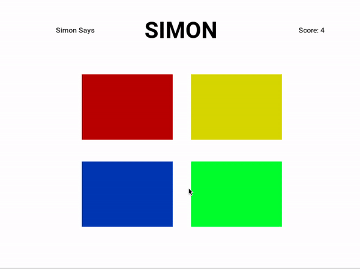

# Simon Says

A simple Simon Says game created using the Python library Kivy for the 10.009 course in Spring 2020.

## Description

When Simon "says" a colour sequence, players must repeat the colour sequence to earn a point and move on to the next round. Rounds get progressively harder as Simon gives longer and longer sequences. Look closely, as a single misstep will mean game over.

This game was created as part of a mini project for a Python coding fundamentals course. As such, the game functionality was kept simple. Some possible extensions to this game incldue:

- Keeping track of a high score to bring out the competitive spirit of players
- Adding sound effects for button clicks, successful rounds and game over
